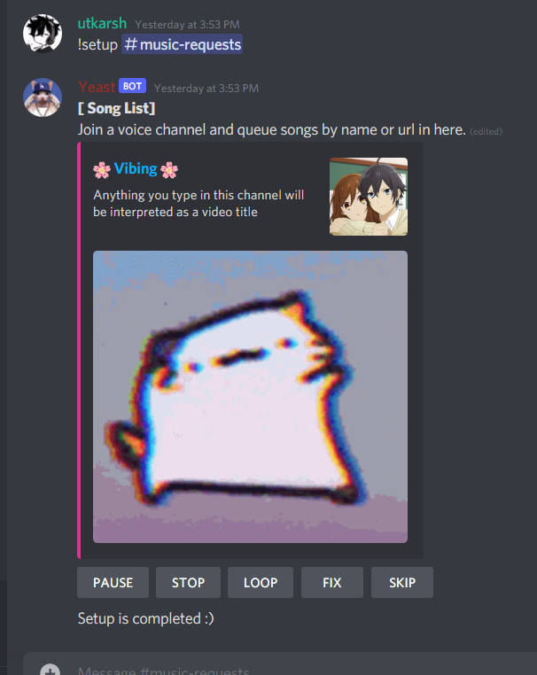

# Yeast
Yeast is a one command discord music bot with GUI based functionalities

# ✨ Advanced Music Bot
Everybody gets so excited when they hear about music bots. I always hear people asking "how to make a music bot", "how can I get a music bot for free" etc.
It was my intention to make an app that gives the feeling that you are playing music using some sort of player. A bot known as Hydra operates on the same concept.

Due to lack of time, I was unable to implement more features such as Soundcloud and Deezer links support, but I promise to push the updates as soon as possible

### ‣ Why the app is advance?
- It supports Youtube playlist 
- Easy to setup
- No Music Commands Required
- Works like a audio player
- No Voice Channel ID required
- Works in Multi Server
- Supports Spotify playlist, track and albums.

### ‣ How to setup?

As soon as you install the app, it will ask for few values which are described below and after the installation make sure to set timeout(ms) value `30000`.

 - Key: its a secret key, it can be anything ( you can just smash your keyboard ) or can be a random string
 - PLAYLIST_LIMIT: its the number of song the bot will take from the playlist if given

**NOTE**: Make sure you give your Music bot the Admin role as it will need to destroy messages that are not music links.

### ‣ How to run the bot?
After the setup, go to your server and use the `!setup` command, this command will assign the music channel for you.
Next thing you need to do is to go to that channel and send the name of the song while being in the VC.

### ‣ Control Center
As i already mentioned that this bot works as player so there is no command other than setup command, everything is controlled through buttons. below are the details on what each button do -:
- **PAUSE/RESUME** : It just pause/resume the current song.
- **STOP**: It stops the bot and disconnect it from VC.
- **LOOP**: It enables/disable the loop.
- **FIX**: You can use this button when you see bot is not doing what it should.
- **SKIP**: Skips the current song.

### ‣ Showcase

- 💪 App Author: **utkarsh#2323**
